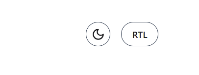

# React Animated Cards 

## Overview

This project is an animated React UI featuring:

* A responsive hero section
* A dynamic grid of 6 cards with animation
* Light/dark theme toggle
* RTL (Right-to-Left) layout toggle
* Smooth entrance animations using Framer Motion


---

## Project Structure

```
src/
├── components/
│   ├── Card.js
│   ├── CardGrid.js
│   ├── Header.js
│   └── HeroSection.js
├── App.js
├── index.js
```

---

## Features

### 1. Hero Section

* Displays the main title and subtitle.
* Features a gradient text effect for emphasis.
* Includes a call-to-action button.


### 2. Cards Grid

* 6 animated cards fetched from a placeholder image API.
* Each card contains an image, title, description, price, and a CTA button.
* Interactive heart icon to favorite/unfavorite cards.
* Responsive layout using Tailwind CSS.


### 3. Theme Toggle

* Allows switching between light and dark modes.
* Uses `localStorage` to persist theme preference.


### 4. RTL Toggle

* Switches layout between LTR (default) and RTL (for Arabic/Hebrew support).



### 5. Framer Motion Animations

* Smooth page entrance and hover effects on cards.


---

## Installation

```bash
git clone https://github.com/ZakiaHussaini/react-cards.git
cd react-cards
npm install
npm start
```


